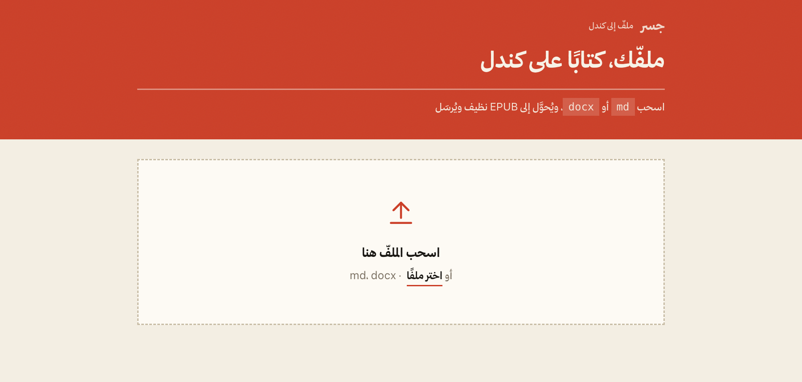
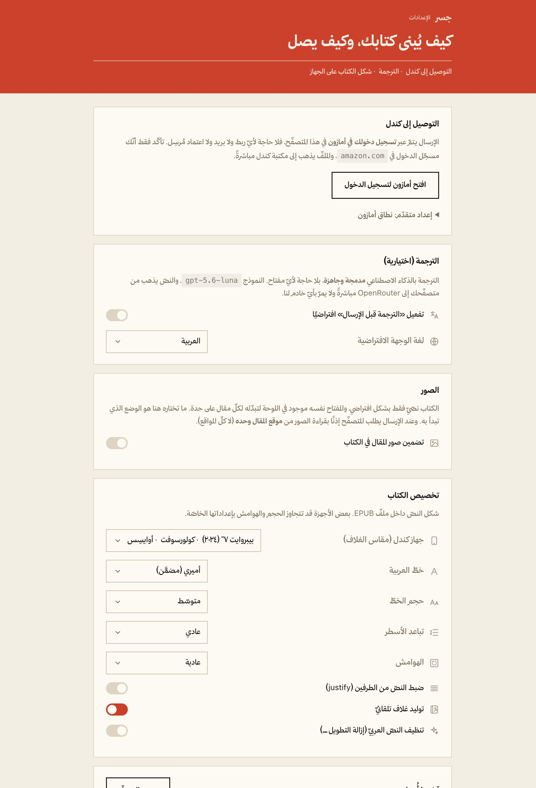

<p align="center">
  
</p>

<h1 align="center">جسر · Jisr</h1>

<p align="center">
  Turn the article in your browser into a polished EPUB, translate it when needed,
  and send it directly to your Kindle library.
</p>

<p align="center">
  <a href=".github/workflows/ci.yml"></a>
  
  <a href="LICENSE"></a>
</p>

No email, approved-sender list, companion app, or Jisr server is involved. Delivery
uses your existing Amazon session, while extraction and EPUB generation happen
locally inside the browser. Arabic, RTL layout, bilingual books, study glossaries,
and optional AI translation are built in.

## Product tour

<p align="center">
  
</p>

<p align="center"><sub>The article becomes a live book-cover preview before it is sent or downloaded.</sub></p>

### More than a web clipper

<p align="center">
  
</p>

<p align="center"><sub>Drop a Markdown or Word document and turn it into a clean Kindle book.</sub></p>

<details>
  <summary><strong>Book, translation, image, and Kindle-device settings</strong></summary>
  <br />
  
</details>

---

## Why this exists

Every "send to Kindle" tool falls into one of two camps:

- **Email-based** (Push to Kindle, Instapaper, KTool, Readwise): you must add an
  approved sender address in Amazon, configure email, and your article passes
  through a third‑party server. Fiddly, and not private.
- **Amazon's official extension**: clean and serverless — but it doesn't do clean
  Arabic (RTL) rendering, and it can't translate.

Jisr keeps the **clean, serverless delivery** of Amazon's own extension and adds
what it lacks: reliable Arabic publishing, controllable EPUB output, translation,
and study-oriented reading modes.

## Features

- **One-click send** to your Kindle library, or download the EPUB and use the
  official Send to Kindle page as a fallback.
- **Robust extraction** — Mozilla Readability with a **main-region fallback** for
  pages that split content across sibling containers (e.g. AWS/AEM "what-is"
  pages), where naive extractors grab only the first section. Works on
  paywalled / logged-in pages you can already read (it reads the rendered page).
- **Clean EPUB3** output with navigable TOC, preserved code and tables, popup
  footnotes, source metadata, image limits, and strict XHTML checks.
- **Arabic & RTL done right** — content-based whole-document direction,
  `page-progression-direction`, `dir="rtl"`, bidi-safe inline English, and a
  choice between embedded Amiri and the Kindle's native font.
- **Built-in AI translation** via OpenRouter, with bounded concurrent batches,
  retries, model fallback, cancellation, and structural checks that prevent a
  malformed response from silently blanking the article.
- **Bilingual and study modes** — interleave the source with its translation and
  optionally annotate terms as Kindle popup-footnote glossaries.
- **Book-quality covers** — use the article's lead image or a generated motif,
  edit title and author in place, and size the cover for the selected Kindle.
- **Drag & drop files** — drop a Markdown (`.md`) or Word (`.docx`) file (e.g. a
  ChatGPT answer you exported) and it becomes a clean EPUB on your Kindle.
- **Preview, selection, and recovery tools** — preview before sending, send only
  selected text, manually pick the right page region, and cancel long jobs.
- **Reading list and local history** — combine several articles into one EPUB and
  reopen recently sent sources without creating an account.
- **Private by design** — see [Privacy](#privacy).

## How it works

```
┌──────────────┐   Readability    ┌──────────────┐   your Amazon    ┌──────────────┐
│  the article │ ───────────────▶ │  clean EPUB3 │ ───  session ──▶ │ Kindle library│
│ (in browser) │   (+ translate)  │ (in browser) │  (cookies+CSRF)  │  (all devices)│
└──────────────┘                  └──────────────┘                  └──────────────┘
```

Delivery replicates Amazon's official *Send to Kindle* web flow, **verified
byte‑for‑byte against the official extension's source (v2.1.1.7)**:

1. `GET /sendtokindle/empty` → scrape the anti‑CSRF token; `GET
   /sendtokindle/extension/checkAuth` → confirm you're signed in.
2. `POST /sendtokindle/init` → a pre‑signed S3 upload URL + an `stkToken`.
3. `PUT` the EPUB bytes to S3.
4. `POST /sendtokindle/send-v2` → Amazon converts and delivers to your library.

All of this runs **inside the extension**, authenticated by the amazon.com session
you're already logged into — exactly like Amazon's own extension. There is **no
server** in the delivery path.

## Install (developer mode)

```text
1. Clone https://github.com/Ajarallah/jisr-article-to-kindle.git.
2. Open your browser's extensions page (brave://extensions or chrome://extensions).
3. Enable "Developer mode".
4. "Load unpacked" → select the extension/ folder.
5. Make sure you're signed in to Amazon in the same browser.
```

A packaged zip for the Web Store is produced by `scripts/package-extension.sh`.

## Usage

1. Open any article and click the **جسر** toolbar icon.
2. Review the extracted title, author, cover, and optional image setting.
3. Optionally enable translation, bilingual mode, or the study glossary.
4. Click **إرسال إلى كندل**. The book normally appears in your library within a
   few minutes. Use **تنزيل** when you only want the EPUB.

To send a **file** instead of a page, click *"أرسِل ملفًّا (md / docx)"* in the
popup and drop your file. To review the article (and its translation) before it
goes to your Kindle, click *"معاينة قبل الإرسال"*.

### Translation

Translation is built in and needs no setup in a prepared local build. Development
builds read the OpenRouter key from `extension/src/secrets.js` (git-ignored — copy
`secrets.example.js` and add your own key). A key entered by the user is stored in
`chrome.storage.local`, never synced. The current primary model is
`openai/gpt-5.6-luna`, with `deepseek/deepseek-v4-flash` as fallback. Article text
goes from the browser to OpenRouter and never through a Jisr server.

**Before publishing to a store:** a key inside an extension is not secret — the
package is a plain zip. Move it behind a proxy you operate and repoint
`translationEndpoint` first.

## Privacy

In normal use the extension talks to exactly two places, both yours:

- **Amazon** — your own account, to deliver the file (same as Amazon's extension).
- **OpenRouter** — only if you turn on translation; the article text, nothing else.

No server operated by this project sits in the path. No analytics, no tracking, no
telemetry, no accounts. Full policy: [`store/PRIVACY.md`](store/PRIVACY.md).

## Project layout

```
extension/               the whole product — a Manifest V3 extension
  manifest.json
  src/
    popup.*              toolbar UI, live cover, and orchestration
    options.*            delivery, translation, image, and book preferences
    extract.js           article extraction (Readability)
    epub.js              clean EPUB3 builder (RTL, images, cover, TOC, font)
    translate.js         structure-preserving translation (OpenRouter)
    deliver.js           Send-to-Kindle delivery (Amazon session; verified vs official)
    covers.js            shared popup/EPUB cover artwork
    glossary.js          study glossary as popup footnotes
    readinglist.js       multi-article book queue
  lib/                   vendored: Readability, JSZip, Amiri font
docs/                    research, architecture, decision log, competitive analysis
store/                   privacy policy + Chrome Web Store listing
scripts/                 packaging
server/                  Node-based test, lint, and icon-generation harness only
```

## Verification

- **54 automated tests** currently cover extraction, EPUB output, cover sizing,
  delivery, translation recovery, glossary, cancellation, and imports. Run
  `cd server && npm test`.
- **ESLint and CI** run against the extension modules and Node test harness.
- **Delivery protocol** is verified byte‑for‑byte against the official *Send to
  Kindle* extension source (endpoints, headers, field names, the
  `application/epub+zip` data type, the auth model). See
  [`docs/03-official-s2k-mechanism.md`](docs/03-official-s2k-mechanism.md).
- **Live reachability** confirmed against a real Amazon session (CSRF scrape +
  endpoint calls return 200). A full end‑to‑end send requires being signed in to
  Amazon in the browser — the same requirement as Amazon's own extension.

## Roadmap

- Verify Arabic font shaping, bilingual layout, footnote popups, images, and
  device-sized covers on physical Kindle hardware before making release claims.
- Make lead-image covers request the image CDN origin when needed, then fall
  back visibly to a generated motif instead of leaving an unexplained blank band.
- Move long-running jobs from the disposable browser popup into a persistent
  side panel.
- Replace the crowded set of per-article switches with saved modes such as
  “Quick send”, “Translated”, and “Bilingual + glossary”.
- Move the bundled translation credential behind an operated proxy before a
  public store release; credentials shipped inside an extension are extractable.

## Compatibility

Any Chromium browser: **Brave**, Chrome, Edge, Arc. Requires being signed in to
Amazon in that browser.

## Legal / risk note

Delivery uses Amazon's private *Send to Kindle* web endpoints — the same ones
Amazon's own extension uses. These are undocumented and could change; see
`docs/DECISIONS.md` (D9–D11) for the reasoning and fallbacks.

## License

[MIT](LICENSE) — third‑party components: Mozilla Readability (Apache‑2.0), JSZip
(MIT/GPL), Amiri font (OFL‑1.1).
