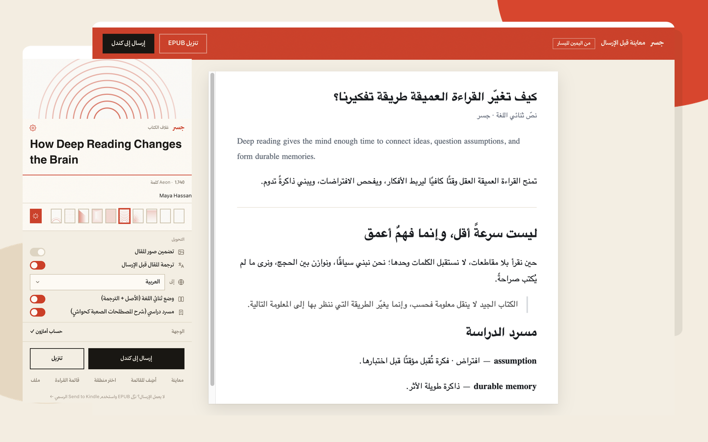
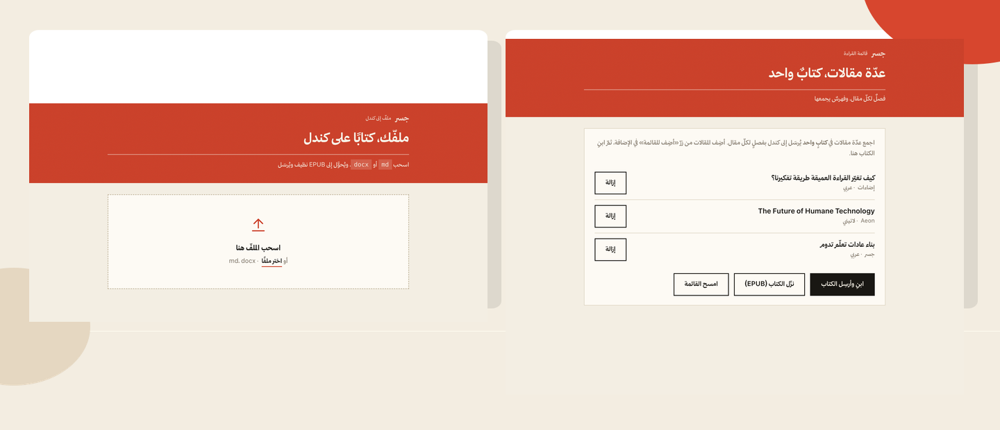

<p align="center">
  
</p>

<h1 align="center">جسر · Jisr</h1>

<p align="center">
  <strong>من أي مقال إلى كتاب كندل يليق بالقراءة.</strong><br />
  Turn any article into a polished Kindle book — beautiful Arabic typesetting, optional AI translation, and no email setup or Jisr server.
</p>

<p align="center">
  <a href="https://github.com/Ajarallah/jisr-article-to-kindle/actions/workflows/ci.yml"></a>
  
  <a href="LICENSE"></a>
</p>

<p align="center">
  
</p>

<p align="center">
  <sub>Actual Jisr interfaces: translation and study controls on the left; the pre-send bilingual reader preview on the right.</sub>
</p>

## What Jisr does

Jisr is a Chrome extension that turns the article open in your browser into a clean EPUB and sends it to your Kindle library. Extraction, book building, and cover generation happen locally in the browser.

<table>
  <tr>
    <td width="33%">
      <strong>1 · Capture</strong><br />
      Reads the rendered page you can already see, including logged-in and paywalled pages.
    </td>
    <td width="33%">
      <strong>2 · Build</strong><br />
      Creates a Kindle-ready EPUB with typography, metadata, navigation, images, and a real cover.
    </td>
    <td width="33%">
      <strong>3 · Send</strong><br />
      Delivers through your existing Amazon session, or downloads the EPUB for the official Send to Kindle page.
    </td>
  </tr>
</table>

No Jisr account. No approved-sender email. No article passing through a Jisr server.

## Built for Arabic reading

- Correct RTL book direction, bidi-safe English inside Arabic, and Arabic-aware typography.
- Optional AI translation with retries, fallback, cancellation, and checks against missing text.
- A bilingual mode that keeps the original beside each translated passage.
- A study glossary that turns difficult terms into Kindle popup footnotes.
- Editable title and author, article-image or generated covers, and cover sizes for current Kindle devices.
- Reader preview before sending, plus EPUB download at every stage.

Jisr can also:

- turn Markdown and Word files into EPUBs;
- send only highlighted text or a manually selected page region;
- combine several saved articles into one book;
- keep a private, local history of recently sent articles.

<p align="center">
  
</p>

<p align="center">
  <sub>Secondary workflows: convert a Markdown or Word file, or collect several articles into one book with its own table of contents.</sub>
</p>

## Install

Jisr is currently installed in developer mode:

```bash
git clone https://github.com/Ajarallah/jisr-article-to-kindle.git
```

1. Open `chrome://extensions` or `brave://extensions`.
2. Enable **Developer mode**.
3. Choose **Load unpacked**.
4. Select the repository's `extension/` directory.
5. Sign in to the Amazon account connected to your Kindle in the same browser.

## Use

1. Open an article and click the **جسر** toolbar icon.
2. Review the extracted title, author, and cover.
3. Optionally include images, translate, create a bilingual book, or add a study glossary.
4. Choose **معاينة** to inspect the book, then **إرسال إلى كندل** or **تنزيل**.

The book usually appears in the Kindle library within a few minutes.

## Privacy and translation

Normal delivery involves only the services required for the selected action:

- **Amazon** receives the generated EPUB through your signed-in Send to Kindle session.
- **OpenRouter** receives article text only when translation or the glossary is enabled.

Jisr has no analytics, tracking, account system, or hosted content pipeline. See the full [privacy policy](store/PRIVACY.md).

Development builds load an OpenRouter key from the git-ignored `extension/src/secrets.js`. A user-provided key is stored in `chrome.storage.local`, not synced. A public store release must put any bundled credential behind a controlled proxy because secrets shipped inside an extension can be extracted.

## Current status

Jisr is an active pre-release project.

- 54 automated tests cover extraction, EPUB output, delivery, translation recovery, covers, glossary behavior, and cancellation.
- ESLint and GitHub Actions run on every pushed change.
- Direct delivery has been verified against Amazon's Send to Kindle flow.
- Final release claims still require repeated physical-Kindle checks for Arabic shaping, bilingual layout, popup footnotes, images, and device-specific covers.
- Amazon's delivery endpoints are private and undocumented, so EPUB download remains a permanent fallback.

## Development

```bash
cd server
npm ci
npm test
npm run lint
```

Package the extension:

```bash
./scripts/package-extension.sh
```

<details>
  <summary><strong>Architecture and technical notes</strong></summary>
  <br />

  The product is the Manifest V3 extension under `extension/`. The `server/` directory is only the Node test, lint, and asset-generation harness; it is not part of the delivery path.

  - [Architecture](docs/architecture.md)
  - [Design decisions](docs/DECISIONS.md)
  - [Send to Kindle mechanism](docs/03-official-s2k-mechanism.md)
  - [Changelog](CHANGELOG.md)
</details>

## Compatibility

Chrome, Brave, Edge, Arc, and other Chromium browsers that support Manifest V3.

## License

[MIT](LICENSE). Third-party components retain their own licenses, including Mozilla Readability, JSZip, Amiri, and the credited icon assets.
